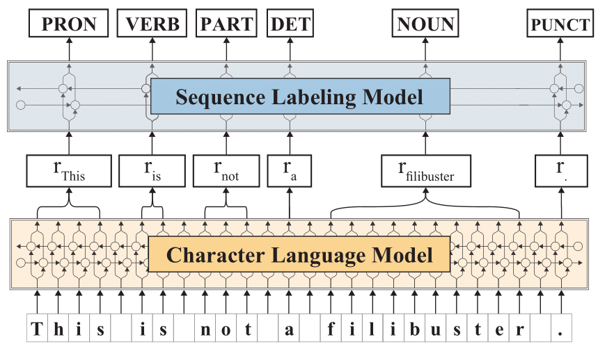

# Contextualized String Embeddings for PoS Tagging: A Multilingual Evaluation

*Contextualized string embeddings* as proposed by [Akbik et al. (2018)](https://www.aclweb.org/anthology/C18-1139/)
are a recent type of contextualized word embedding that are based on
character-level language models. They were shown to yield state-of-the-art
results in many named entity recognition tasks. However, their multilingual
performance on part-of-speech tagging tasks has only received little attention.

In this repository, we conduct an extensive evaluation for sequence tagging on
the [Universal Dependencies](https://universaldependencies.org) project.
We show that contextualized string embeddings
outperform the state-of-the-art neural network approaches like BiLSTMs or deep
bidirectional encoder representations from transformers (BERT) for PoS tagging,
resulting in a new state-of-the-art.

# Changelog

* **14.09.2019**: Initial version released.

# Datasets

We train and evaluate PoS tagging models on 21 languages from the Universal
Dependencies project. The following table shows an overview of
training, development and test dataset sizes for each language:

| Language        | # Train | # Dev | # Test
| --------------- | ------- | ----- | -------
| Bulgarian (bg)  | 8,907   | 1,115 | 1,116
| Czech (cs)      | 68,495  | 9,270 | 10,148
| Danish (da)     | 4,868   | 322   | 322
| German (de)     | 14,118  | 799   | 977
| English (en)    | 12,543  | 2,002 | 2,077
| Spanish (es)    | 14,187  | 1,552 | 274
| Basque (eu)     | 5,396   | 1,798 | 1,799
| Persian (fa)    | 4,798   | 599   | 600
| Finnish (fi)    | 12,217  | 716   | 648
| French (fr)     | 14,552  | 1,596 | 298
| Hebrew (he)     | 5,241   | 484   | 491
| Hindi (hi)      | 13,304  | 1,659 | 1,684
| Croatian (hr)   | 3,557   | 200   | 200
| Indonesian (id) | 4,477   | 559   | 557
| Italian (it)    | 11,699  | 489   | 489
| Dutch (nl)      | 13,000  | 349   | 386
| Norwegian (no)  | 15,696  | 2,410 | 1,939
| Polish (pl)     | 6,800   | 700   | 727
| Portuguese (pt) | 8,800   | 271   | 288
| Slovenian (sl)  | 6,471   | 735   | 790
| Swedish (sv)    | 4,303   | 504   | 1,219

The next table gives an overview of languages and language families
that were used in our experiments - grouping is reproduced from
[Plank et al. (2016)](https://arxiv.org/abs/1604.05529):

| Language        | Coarse           | Fine
| --------------- | ---------------- | ----
| Bulgarian (bg)  | Indoeuropean	 | Slavic
| Czech (cs)      | Indoeuropean	 | Slavic
| Danish (da)     | Indoeuropean	 | Germanic
| German (de)     | Indoeuropean	 | Germanic
| English (en)    | Indoeuropean	 | Germanic
| Spanish (es)    | Indoeuropean	 | Romance
| Basque (eu)     | Language isolate | -
| Persian (fa)    | Indoeuropean	 | Indo-Iranian
| Finnish (fi)    | non-IE	         | Uralic
| French (fr)     | Indoeuropean	 | Romance
| Hebrew (he)     | non-IE	         | Semitic
| Hindi (hi)      | Indoeuropean	 | Indo-Iranian
| Croatian (hr)   | Indoeuropean	 | Slavic
| Indonesian (id) | non-IE	         | Austronesian
| Italian (it)    | Indoeuropean	 | Romance
| Dutch (nl)      | Indoeuropean	 | Germanic
| Norwegian (no)  | Indoeuropean	 | Germanic
| Polish (pl)     | Indoeuropean	 | Slavic
| Portuguese (pt) | Indoeuropean	 | Romance
| Slovenian (sl)  | Indoeuropean	 | Slavic
| Swedish (sv)    | Indoeuropean	 | Germanic

# Model

We use the latest version of Flair in our experiments. The next
figure shows a high-level overview of the used architecture for
PoS tagging:

For training our PoS tagging models we use a BiLSTM with a hidden
size of 256, a mini batch size of 8 and an initial learning rate
of 0.1. We reduce the learning rate by a factor of 0.5 with a
patience of 3. This factor determines the number of epochs with
no improvement after which learning rate will be reduced. We train
for a maximum of 500 epochs and use stochastic gradient descent as
optimizer. For each language we train PoS tagging models and evaluate
3 runs and report an averaged accuracy score.

# Pre-training

We trained contextualized string embeddings for 16 of 21 languages
in the Universal Dependencies. For the remaining 5 languages
(English, French, German, Portugese and Spanish) embeddings were
trained by [Akbik et al. (2018)](https://www.aclweb.org/anthology/C18-1139/).

For each language, a recent Wikipedia dump and various texts from the
[OPUS corpora collection](http://opus.nlpl.eu/) are used for training.
A detailed overview can be found in the [flair-lms](https://github.com/stefan-it/flair-lms)
repository.

Additionally, we trained one language model for over 300 languages on the
recently released [JW300](https://www.aclweb.org/anthology/P19-1310/) corpus.
The corpus size of the JW300 corpus is 2.025.826.977 token. We trained a model
over 5 epochs (both for the forward and backward language model).

# Results

The next table shows the results for all trained contextualized string
embeddings (*Flair Embeddings*):

| Lang.        | BiLSTM | Adv. 	| MultiBPEmb | BERT + BPEmb	| JW300	| Flair Embeddings
| ------------ | ------ | ----- | ---------- | ------------ | ----- | ----------------
| Avg.         | 96.40  | 96.65	| 96.62	     | 96.77	    | 96.77 | **97.59**
| Indoeuropean | 96.63  | 96.94	| 96.99	     | 97.12	    | 96.99 | 97.78
| non-Indo.    | 95.41  | 95.62	| 94.87	     | 95.03	    | 95.75 | 96.63
| Germanic     | 95.49  | 95.80	| 95.97	     | 96.15	    | 96.21 | 96.89
| Romance      | 96.93  | 97.31	| 97.25	     | 97.35	    | 97.33 | 97.81
| Slavic       | 97.50  | 97.87	| 97.98	     | 98.00	    | 98.19 | 98.71
| bg           | 97.97  | 98.53	| 98.70	     | 98.70	    | 98.97 | 99.15
| cs           | 98.24  | 98.81	| 98.90	     | 99.00	    | 98.83 | 99.14
| da           | 96.35  | 96.74	| 97.00	     | 97.20	    | 97.72 | 98.51‡
| de           | 93.38  | 94.35	| 94.00	     | 94.40	    | 94.12 | 94.88
| en           | 95.16  | 95.82	| 95.60	     | 96.10	    | 96.08 | 96.89
| es           | 95.74  | 96.44	| 96.50	     | 96.80	    | 96.67 | 97.39
| eu           | 95.51  | 94.71	| 95.60	     | 96.00	    | 96.11 | 97.32‡
| fa           | 97.49  | 97.51	| 97.10	     | 97.30	    | 94.06 | 98.17
| fi           | 95.85  | 95.40 | 94.60	     | 94.30	    | 96.59 | 98.09‡
| fr           | 96.11  | 96.63	| 96.20	     | 96.50	    | 96.36 | 96.65
| he           | 96.96  | 97.43	| 96.60	     | 97.30	    | 96.71	| 97.81
| hi           | 97.10  | 97.97	| 97.00      | 97.40	    | 97.18	| 97.89
| hr           | 96.82  | 96.32	| 96.80	     | 96.80	    | 96.93 | 97.55
| id           | 93.41  | 94.03	| 93.40	     | 93.50	    | 93.96 | 93.99
| it           | 97.95  | 98.08	| 98.10	     | 98.00	    | 98.15 | 98.50
| nl           | 93.30  | 93.09	| 93.80	     | 93.30	    | 93.06 | 93.85
| no           | 98.03  | 98.08	| 98.10	     | 98.50	    | 98.38 | 98.74
| pl           | 97.62  | 97.57	| 97.50	     | 97.60	    | 97.99 | 98.68‡
| pt           | 97.90  | 98.07	| 98.20	     | 98.10	    | 98.15 | 98.71
| sl           | 96.84  | 98.11	| 98.00	     | 97.90	    | 98.24 | 99.01
| sv           | 96.69  | 96.70 | 97.30	     | 97.40	    | 97.91 | 98.49

*BiLSTM* refers to the tagger, proposed by [Plank et al. (2016)](https://arxiv.org/abs/1604.05529).
*Adv.* refers to adversarial training as proposed by [Yasunaga et al. (2017)](https://arxiv.org/abs/1711.04903).

*MultiBPEmb* and *BERT + BPEmb* refer to the [Heinzerling and Strube (2019)](https://arxiv.org/abs/1906.01569)
paper.

‡ indicates a performance boost of > 1% compared to previous state-of-the-art.

# ToDo

* [ ] Provide training scripts for PoS tagging models
* [ ] Add download link to the JW300 model in [flair-lms](https://github.com/stefan-it/flair-lms) repository

# Citing

Originally, I wrote a short-paper about the multilingual evaluation that is presented in this
repository. The paper was accepted at the [Konvens 2019](https://2019.konvens.org/) conference.
However, I did withdraw the paper because I felt uncomfortable with the analysis section. For
example it is still unclear, why the performance of the Finnish model is over 2% better than previous
state-of-the-art models, whereas the corpus used for pretraining is relatively small compared to
other languages.

However, if you use the pretrained language models in your work, please cite this GitHub repository 🤗
